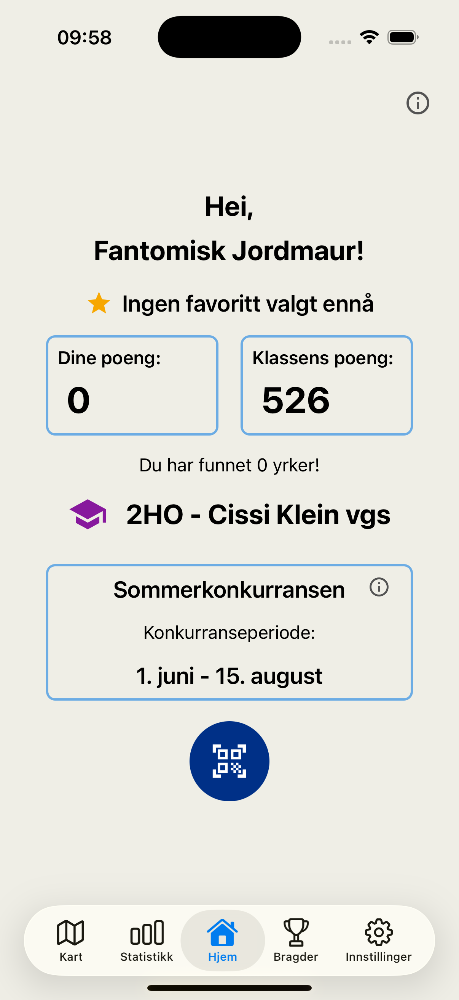
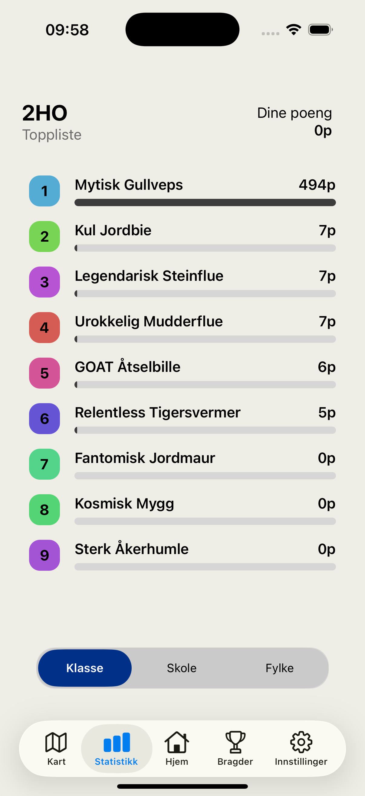
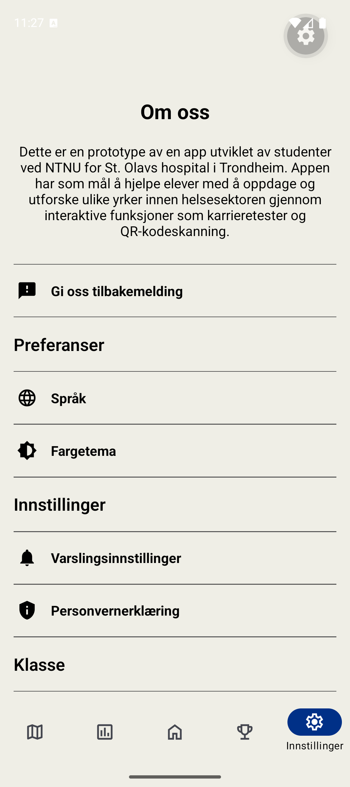
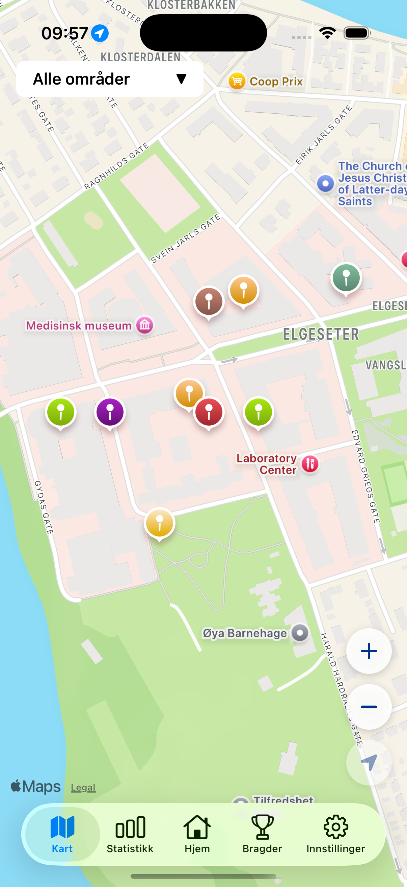
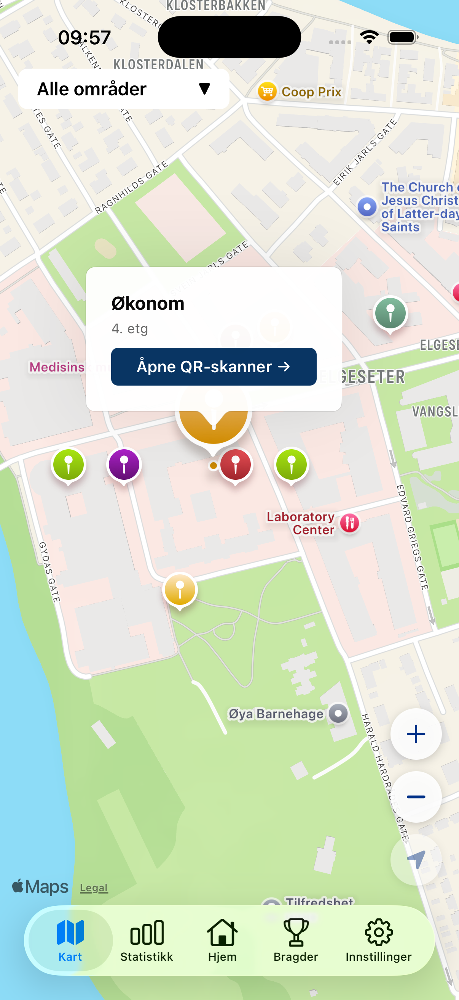
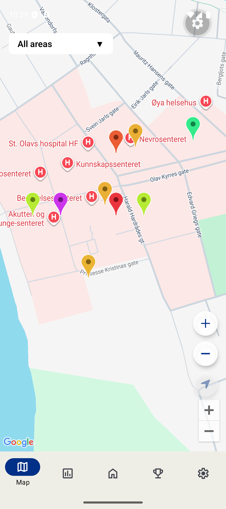
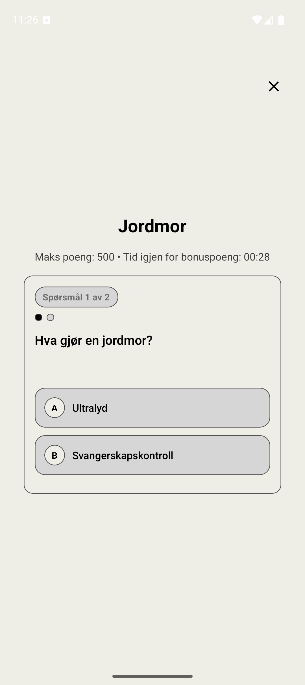
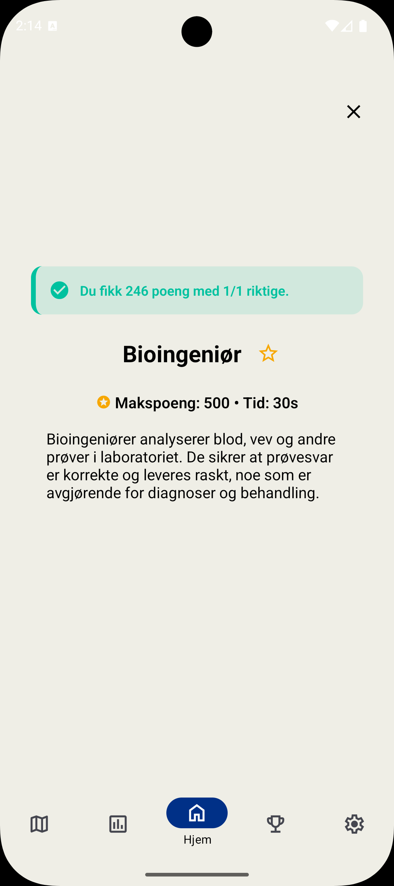
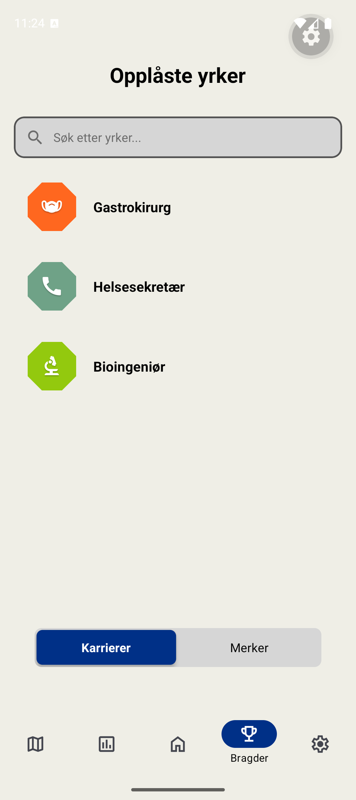

# SJUK Frontend

Mobile frontend for SJUK (St. Olavs Jakt etter Utdanning- og Karrieremuligheter), built with Expo, React Native, and Expo Router.

The app helps users explore careers through QR scanning, map-based discovery, quizzes, class competitions, achievements, and unlocked career content.

## Screenshots

#### Hovedskjermer & Navigasjon
<p align="left">
  
  
  
</p>

#### Kart og Lokasjon
<p align="left">
  
  
  
</p>

#### Karriere & Quiz
<p align="left">
  
  
  
  
</p>

## Features

- Home flow with user summary, competition info, and class join modal
- QR scanner flow for career discovery
- Interactive map experience
- Stats with class, school, and city leaderboards
- Achievements and unlocked careers
- Settings for language, theme, notifications, privacy, feedback, and class leave

## Tech stack

- Expo SDK 55
- React Native 0.83.6
- React 19
- Expo Router (file-based routing)
- i18next + react-i18next (multilingual UI)
- Axios (API client)
- Jest + @testing-library/react-native (testing)

## Project structure

- [app/](app/): Expo Router routes
  - [app/(tabs)/index.tsx](<app/(tabs)/index.tsx>): home screen
  - [app/(tabs)/map.tsx](<app/(tabs)/map.tsx>): map screen
  - [app/(tabs)/stats/](<app/(tabs)/stats/>): scoreboards
  - [app/(tabs)/achievements.tsx](<app/(tabs)/achievements.tsx>): careers and badges
  - [app/(tabs)/settings/](<app/(tabs)/settings/>): settings subpages
- [src/components/](src/components/): reusable UI and feature components
- [src/hooks/](src/hooks/): custom hooks for home, QR scanner, theming, quiz, and more
- [src/context/](src/context/): global context providers
- [src/i18n/](src/i18n/): localization config and translation files
- [services/](services/): API and storage layer
- [**tests**/](__tests__/): unit and integration tests
- [**mocks**/](__mocks__/): test mocks for Expo and native dependencies

## Getting started

### Prerequisites

- Node.js 20.19.4 or newer
- Xcode for iOS simulator and builds
- Android Studio for Android emulator and builds
- A running backend server for API requests

### First-time setup

1. Start the backend server.

   The frontend expects the API to be available before you launch the app. Backend repository: https://github.com/Bachelorgruppe-53/idatt2901_gr_53_backend

2. Install dependencies.

```bash
npm install
```

3. Build and install a development client.

   This app uses native modules such as camera, maps, secure storage, and the dev menu, so Expo Go is not enough for full functionality.

   Make sure your simulator or emulator is already running:
   - iOS: open the Simulator from Xcode > Open Developer Tool > Simulator
   - Android: start an emulator from Android Studio’s Virtual Device Manager

   Then install the dev client:

```bash
npx expo run:ios
```

or

```bash
npx expo run:android
```

4. Start Metro.

```bash
npx expo start --dev-client
```

5. Open the app from Metro.
   - Press `i` for iOS
   - Press `a` for Android

### Daily development

Once the dev client is installed, start the app with:

```bash
npx expo start --clear
```

Use `--clear` if you hit stale imports or module issues. If you install new native packages or change config plugins, rebuild the dev client with `npx expo run:ios` or `npx expo run:android`.

## Available scripts

- `npm run lint`: run Expo ESLint checks
- `npm test`: run Jest tests
- `npm run test:watch`: run Jest in watch mode

Run coverage with:

```bash
npm test -- --coverage --watch=false
```

## App architecture

- [app/\_layout.tsx](app/_layout.tsx) sets up root providers and stack navigation
- [app/(tabs)/\_layout.tsx](<app/(tabs)/_layout.tsx>) defines native tab navigation
- Theme is managed globally in [src/context/ThemeContext.tsx](src/context/ThemeContext.tsx)
- Localization is initialized in [src/i18n/config.ts](src/i18n/config.ts)

### Localization

Supported language tags:

- `en-US`
- `no-NB`
- `no-NN`

Translation namespaces include common, auth, navbar, settings, home, aboutCareer, stats, class, quiz, map, and qrScanner.

### Theming

Theme modes:

- `system`
- `light`
- `dark`

Theme preferences are persisted in secure storage.

### Backend integration

API base URL is resolved by:

1. `EXPO_PUBLIC_API_URL` if it is set
2. Expo dev host IP in development
3. Android emulator fallback `10.0.2.2`
4. default host fallback

See [services/apiConfig.ts](services/apiConfig.ts) and [services/authService.ts](services/authService.ts) for details.

## EAS build and release

Build profiles are defined in [eas.json](eas.json):

- `development`
- `development-simulator`
- `preview`
- `production`

Typical commands:

```bash
npx eas-cli@latest build --platform ios -s
npx eas-cli@latest build --platform android -s
```

## Testing

The test suite in [**tests**/](__tests__/) covers hooks, service modules, context logic, and component behavior.

The project uses manual Jest mocks for native Expo packages in [**mocks**/](__mocks__/) to keep tests fast and avoid native module errors in Node/Jest.

If you hit dependency issues during install, try:

```bash
npm install --legacy-peer-deps
```

## Troubleshooting

- Cannot reach backend:
  - Verify `EXPO_PUBLIC_API_URL` and backend port
  - Confirm the device or emulator can access the backend host
- Expo Go errors or missing native features:
  - Use a development build when native dependencies are required
  - Reinstall the dev client if you see a “No development build installed” error
- Stale Metro cache:
  - Run `npx expo start --clear`

## Documentation

- Expo docs: https://docs.expo.dev
- Expo Router docs: https://docs.expo.dev/router/introduction/
- React Native docs: https://reactnative.dev/docs/getting-started
- EAS docs: https://docs.expo.dev/eas/

## Team

Developed as part of a Bachelor's thesis in Computer Science at NTNU.

- **Anne Cecilie Nilsen** - Frontend (Mobile application Lead)
- **Brahim Helland** - Frontend (Admin Webpages Lead)
- **Ingrid Midtmoen Døvre** - Backend & Database Lead
